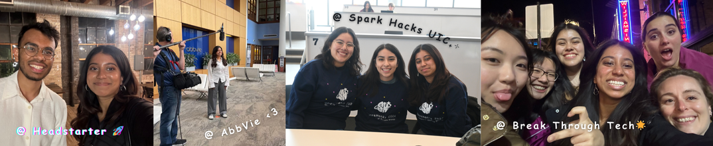

<!-- banner gif generated from : https://willkessler.github.io/typed-text-gif-maker/ -->
<!-- font Ubuntu, size 100, 100 speed, 1500 time  -->

<picture>
  <source media="(prefers-color-scheme: dark)" srcset="./zzaneer_dark.gif">
  
</picture>

<!-- canva image gallery banner -->

  <!-- Left Section with Text -->
  

    <h2>about me:</h2>
    <ul>
      <li>👷‍♀️ This page is currently under construction!</li>
      <li>💼 Computer Science Student @ UIC</li>
      <li>👾 Check out my LinkedIn!</li>
    </ul>
  

  
  <!-- Right Section with Image -->
  

<!--     
  
 -->

<!-- contacts under about me -->  

  
  

---

<!-- TECH STACK -->
<h2>tech stack 🥞</h2>

<table><tr><td valign="top" width="25%">
<h3 align="center">mains</h3>

  
  
  
  
  
  

</a>
 </td><td valign="top" width="25%">
        
<h3 align="center">machine learning </h3>

  
  

  
  
  
  

</a>

</td><td valign="top" width="25%">
  
<h3 align="center">others</h3>

  

  
  
  
  
  
  
  

</a>
</td>
</tr></table>

<!-- MOST USED LANG -->

  
  

<!-- STATS -->

<h3 align="center">the stats</h3>

  

  
  

* disclamer : full-time student. any grass is good grass. <3

<h1></h1>

<!-- FEATURED REPOS  -->

<!-- banner gif generated from : https://willkessler.github.io/typed-text-gif-maker/ -->
<!-- font Ubuntu, size 70, 100 speed, 1700 time  -->
<picture>
  <source media="(prefers-color-scheme: dark)" srcset="./featured_dark.gif">
  
</picture>

<table><tr><td valign="top" width="25%">
  <h3 align="center">Predictive ML Models for Surprise Gift Optimization in Customer Spending (currently under review)</h3>
  

    
  
  

  </a>
 </td><td valign="top" width="25%">
        
<h3 align="center">Mnemo: a flashcard Saas app</h3>

</a>

</td>
</tr></table>

<table><tr><td valign="top" width="25%">
  <h3 align="center">Customer Support AI Chatbot</h3>
  

    
  
  

  </a>
 </td><td valign="top" width="25%">
        
<h3 align="center">A Touch of Green</h3>

</a>

</td>
</tr></table>
